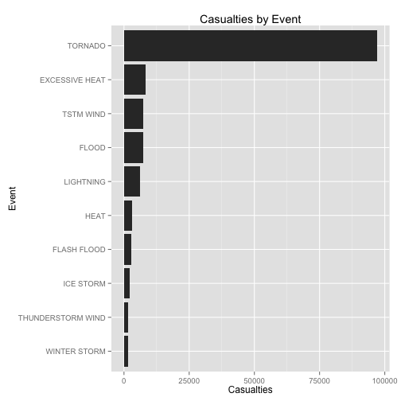
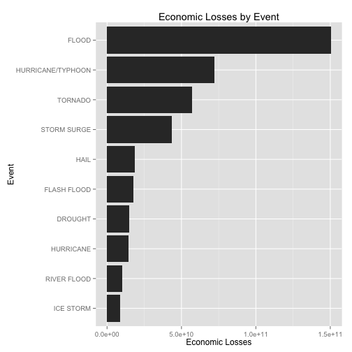

Severe Weather Events in the United States - 1950 through 2011
========================================================

### Synopsis

We analyze severe weather events in the United States to determine what event types lead to the greatest affect population health and economic consequences. As regards this analysis, population health is used to describe both fatalities and injuries. Similarly, economic consequences is used to describe both property damage and crop damage. Based on this analysis, tornadoes have the greatest impact on population health while floods generate the greatest economic consequences.

### Data Processing

All necessary packages for this analysis are loaded first.


```r
library(R.utils)
```

```
## Loading required package: R.oo
## Loading required package: R.methodsS3
## R.methodsS3 v1.6.1 (2014-01-04) successfully loaded. See ?R.methodsS3 for help.
## R.oo v1.18.0 (2014-02-22) successfully loaded. See ?R.oo for help.
## 
## Attaching package: 'R.oo'
## 
## The following objects are masked from 'package:methods':
## 
##     getClasses, getMethods
## 
## The following objects are masked from 'package:base':
## 
##     attach, detach, gc, load, save
## 
## R.utils v1.32.4 (2014-05-14) successfully loaded. See ?R.utils for help.
## 
## Attaching package: 'R.utils'
## 
## The following object is masked from 'package:utils':
## 
##     timestamp
## 
## The following objects are masked from 'package:base':
## 
##     cat, commandArgs, getOption, inherits, isOpen, parse, warnings
```

```r
library(ggplot2)
library(plyr)
```


Next the data set is downloaded and extracted. This set is then loaded into the 'data' data frame.


```r
setwd("C:/Users/jcherrera/Desktop/Peer Assessment 2")

data_url <- "https://d396qusza40orc.cloudfront.net/repdata%2Fdata%2FStormData.csv.bz2"

download.file(data_url, destfile =  "data.csv.bz2", method = "auto")

bunzip2("data.csv.bz2")

data <- read.csv("data.csv")

summary(data)
```


```
#STATE__                  BGN_DATE             BGN_TIME        TIME_ZONE          COUNTY     
# Min.   : 1.0   5/25/2011 0:00:00:  1202   12:00:00 AM: 10163   CST    :547493   Min.   :  0.0  
# 1st Qu.:19.0   4/27/2011 0:00:00:  1193   06:00:00 PM:  7350   EST    :245558   1st Qu.: 31.0  
# Median :30.0   6/9/2011 0:00:00 :  1030   04:00:00 PM:  7261   MST    : 68390   Median : 75.0  
# Mean   :31.2   5/30/2004 0:00:00:  1016   05:00:00 PM:  6891   PST    : 28302   Mean   :100.6  
# 3rd Qu.:45.0   4/4/2011 0:00:00 :  1009   12:00:00 PM:  6703   AST    :  6360   3rd Qu.:131.0  
# Max.   :95.0   4/2/2006 0:00:00 :   981   03:00:00 PM:  6700   HST    :  2563   Max.   :873.0  
#                (Other)          :895866   (Other)    :857229   (Other):  3631                  
#      COUNTYNAME         STATE                      EVTYPE         BGN_RANGE           BGN_AZI      
# JEFFERSON :  7840   TX     : 83728   HAIL             :288661   Min.   :   0.000          :547332  
# WASHINGTON:  7603   KS     : 53440   TSTM WIND        :219940   1st Qu.:   0.000   N      : 86752  
# JACKSON   :  6660   OK     : 46802   THUNDERSTORM WIND: 82563   Median :   0.000   W      : 38446  
# FRANKLIN  :  6256   MO     : 35648   TORNADO          : 60652   Mean   :   1.484   S      : 37558  
# LINCOLN   :  5937   IA     : 31069   FLASH FLOOD      : 54277   3rd Qu.:   1.000   E      : 33178  
# MADISON   :  5632   NE     : 30271   FLOOD            : 25326   Max.   :3749.000   NW     : 24041  
# (Other)   :862369   (Other):621339   (Other)          :170878                      (Other):134990  
#         BGN_LOCATI                  END_DATE             END_TIME        COUNTY_END COUNTYENDN    
#              :287743                    :243411              :238978   Min.   :0    Mode:logical  
# COUNTYWIDE   : 19680   4/27/2011 0:00:00:  1214   06:00:00 PM:  9802   1st Qu.:0    NA's:902297   
# Countywide   :   993   5/25/2011 0:00:00:  1196   05:00:00 PM:  8314   Median :0                  
# SPRINGFIELD  :   843   6/9/2011 0:00:00 :  1021   04:00:00 PM:  8104   Mean   :0                  
# SOUTH PORTION:   810   4/4/2011 0:00:00 :  1007   12:00:00 PM:  7483   3rd Qu.:0                  
# NORTH PORTION:   784   5/30/2004 0:00:00:   998   11:59:00 PM:  7184   Max.   :0                  
# (Other)      :591444   (Other)          :653450   (Other)    :622432                              
#   END_RANGE           END_AZI                 END_LOCATI         LENGTH              WIDTH         
# Min.   :  0.0000          :724837                  :499225   Min.   :   0.0000   Min.   :   0.000  
# 1st Qu.:  0.0000   N      : 28082   COUNTYWIDE     : 19731   1st Qu.:   0.0000   1st Qu.:   0.000  
# Median :  0.0000   S      : 22510   SOUTH PORTION  :   833   Median :   0.0000   Median :   0.000  
# Mean   :  0.9862   W      : 20119   NORTH PORTION  :   780   Mean   :   0.2301   Mean   :   7.503  
# 3rd Qu.:  0.0000   E      : 20047   CENTRAL PORTION:   617   3rd Qu.:   0.0000   3rd Qu.:   0.000  
# Max.   :925.0000   NE     : 14606   SPRINGFIELD    :   575   Max.   :2315.0000   Max.   :4400.000  
#                    (Other): 72096   (Other)        :380536                                         
#       F               MAG            FATALITIES          INJURIES            PROPDMG       
# Min.   :0.0      Min.   :    0.0   Min.   :  0.0000   Min.   :   0.0000   Min.   :   0.00  
# 1st Qu.:0.0      1st Qu.:    0.0   1st Qu.:  0.0000   1st Qu.:   0.0000   1st Qu.:   0.00  
# Median :1.0      Median :   50.0   Median :  0.0000   Median :   0.0000   Median :   0.00  
# Mean   :0.9      Mean   :   46.9   Mean   :  0.0168   Mean   :   0.1557   Mean   :  12.06  
# 3rd Qu.:1.0      3rd Qu.:   75.0   3rd Qu.:  0.0000   3rd Qu.:   0.0000   3rd Qu.:   0.50  
# Max.   :5.0      Max.   :22000.0   Max.   :583.0000   Max.   :1700.0000   Max.   :5000.00  
# NA's   :843563                                                                             
#   PROPDMGEXP        CROPDMG          CROPDMGEXP          WFO        
#        :465934   Min.   :  0.000          :618413          :142069  
# K      :424665   1st Qu.:  0.000   K      :281832   OUN    : 17393  
# M      : 11330   Median :  0.000   M      :  1994   JAN    : 13889  
# 0      :   216   Mean   :  1.527   k      :    21   LWX    : 13174  
# B      :    40   3rd Qu.:  0.000   0      :    19   PHI    : 12551  
# 5      :    28   Max.   :990.000   B      :     9   TSA    : 12483  
# (Other):    84                     (Other):     9   (Other):690738  
#                               STATEOFFIC    
#                                    :248769  
# TEXAS, North                       : 12193  
# ARKANSAS, Central and North Central: 11738  
# IOWA, Central                      : 11345  
# KANSAS, Southwest                  : 11212  
# GEORGIA, North and Central         : 11120  
# (Other)                            :595920  
#                                                                                                                                                                                                    #ZONENAMES     
#                                                                                                                                                                                                         #:594029  
#                                                                                                                                                                                                         #:205988  
# GREATER RENO / CARSON CITY / M - GREATER RENO / CARSON CITY / M                                                                                                                                         #:   639  
# GREATER LAKE TAHOE AREA - GREATER LAKE TAHOE AREA                                                                                                                                                       #:   592  
# JEFFERSON - JEFFERSON                                                                                                                                                                                   #:   303  
# MADISON - MADISON                                                                                                                                                                                       #:   302  
# (Other)                                                                                                                                                                                                 #:100444  
#    LATITUDE      LONGITUDE        LATITUDE_E     LONGITUDE_    
# Min.   :   0   Min.   :-14451   Min.   :   0   Min.   :-14455  
# 1st Qu.:2802   1st Qu.:  7247   1st Qu.:   0   1st Qu.:     0  
# Median :3540   Median :  8707   Median :   0   Median :     0  
# Mean   :2875   Mean   :  6940   Mean   :1452   Mean   :  3509  
# 3rd Qu.:4019   3rd Qu.:  9605   3rd Qu.:3549   3rd Qu.:  8735  
# Max.   :9706   Max.   : 17124   Max.   :9706   Max.   :106220  
# NA's   :47                      NA's   :40                     
#                                           REMARKS           REFNUM      
#                                               :287433   Min.   :     1  
#                                               : 24013   1st Qu.:225575  
# Trees down.\n                                 :  1110   Median :451149  
# Several trees were blown down.\n              :   569   Mean   :451149  
# Trees were downed.\n                          :   446   3rd Qu.:676723  
# Large trees and power lines were blown down.\n:   432   Max.   :902297  
# (Other)                                       :588294                   
```

Next, we consider our two categories of analysis: human loss and economic loss. With regards to human loss, we create a subset using the appropriate columns (event type, fatalities, injuries). We then create a new column, casualities, that sums the fatalities and injuries columns. This column better reflects the true human loss created by the event. This information is then summarized by event type using the plyr package.


```r
health <- data[,c("EVTYPE","FATALITIES","INJURIES")]

health$CASUALTIES <- health$FATALITIES + health$INJURIES

healthsummary <- ddply(health, 
                       .(EVTYPE), 
                       summarize, 
                       TOTAL=sum(CASUALTIES))
```


Similar processes are conducted for the appropriate economic damage related columns (property damage and crop damage). One caveat with this data is the use of exponents for damage calculations (i.e. the PROPDMGEXP column contains the value 'k' when the PROPDMG value is in 1,000s). Additional columns are constructed to input the multiplier needed for the most common exponents (billions, millions, thousands, and hundreds). This information is then computed into 'TOTAL' column. The package, plyr, is again used to summarize the data across event types.


```r
damage <- data[,c("EVTYPE","PROPDMG","PROPDMGEXP","CROPDMG","CROPDMGEXP")]

damage$PROPMULT <- ifelse(damage$PROPDMGEXP == "B", 1000000000,
                   ifelse(damage$PROPDMGEXP == "M", 1000000,
                   ifelse(damage$PROPDMGEXP == "K", 1000,
                   ifelse(damage$PROPDMGEXP == "H", 100, 0))))

damage$CROPMULT <- ifelse(damage$CROPDMGEXP == "B", 1000000000,
                   ifelse(damage$CROPDMGEXP == "M", 1000000,
                   ifelse(damage$CROPDMGEXP == "K", 1000,
                   ifelse(damage$CROPDMGEXP == "H", 100, 0))))

damage$TOTAL <- damage$PROPDMG * damage$PROPMULT + damage$CROPDMG * damage$CROPMULT

damagesummary <- ddply(damage, 
                       .(EVTYPE), 
                       summarize, 
                       TOTAL=sum(TOTAL))
```


### Results

The below plot details the total number of casualties (fatalities and injuries) by event type. This indicates that tornados lead to the greatest human loss of any individual event type.


```r
ggplot(healthsummary[order(healthsummary$TOTAL, decreasing = TRUE)[1:10], ], 
    aes(x = reorder(EVTYPE, TOTAL), y = TOTAL)) + geom_bar(stat = "identity") + 
    coord_flip() + xlab("Event") + ylab("Casualties") + ggtitle("Casualties by Event")
```

 


The below plot details the total economic loss (property and crop damage) by event type. This indicates that floods lead to the greatest economic loss of any individual event type.


```r
ggplot(damagesummary[order(damagesummary$TOTAL, decreasing = TRUE)[1:10], ], 
    aes(x = reorder(EVTYPE, TOTAL), y = TOTAL)) + geom_bar(stat = "identity") + 
    coord_flip() + xlab("Event") + ylab("Economic Losses") + ggtitle("Economic Losses by Event")
```

 

